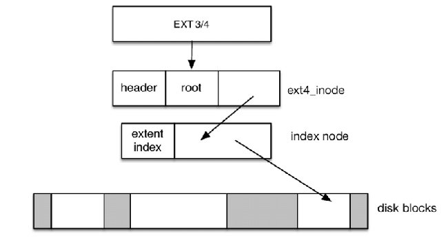

# backup.e4 (bare metal backup/restore for est4 file systems)



**backup.e4** is a bare metal backup and restore utility for common Linux ext file systems. It can produce a sector by sector backup image of any ext4 file system which can be later restored to any partition of equal to or greater size.

## Features

* Only saves sectors that are in use.
* Supports backup to stdout.
* Supports restore from stdin.
* Can be used with compressed and/or encrypted backups.

## Table of Contents

* [Usage](#usage)
	* [Using pipes](#using-pipes)
* [Building from source](#building-from-source)
	* [Requirements](#requirements)
	* [Build](#build)
	* [Install](#install)
* [Security alert](#security-alert)
* [Integration build status](#integration-build-status)
* [Disclaimer](#disclaimer)

## Usage

**backup.e4** has a single command line parameter, the partition path name.

```
$ backup.e4 

Usage: backup.e4 extfs_partition_path

$ restore.e4 

Usage: restore.e4 extfs_partition_path
```

Note: Using no parameters will display help.

Let's backup a file system on partition /dev/sda3.

```
$ sudo backup.e4 /dev/sda3 > sda3_backup

Can't open partition /dev/sda3
Device or resource busy
$ # Oops! Can't produce a safe backup of a mounted file system
$ # Unmount it
$ sudo umount /dev/sda3
$ # Try again
$ sudo backup.e4 /dev/sda3 > sda3.bak
Backing up partition /dev/sda3
4,096 bytes per block, 32,768 blocks per group, 52,428,000 blocks, 1,600 groups
  32 bytes per descriptor
Scanning block groups
  4,244,566 blocks in use
Writing header
Writing partition bitmap
Writing data blocks
..................................................................................................................................
4,244,566 blocks dumped (17,385,742,336 bytes)
Elapsed time 00:03:11
$ # Better!
```
Or, we can compress the backup file.

```
$ sudo backup.e4 /dev/sda3 | gzip -1 -q > sda3_compresse.bak
Backing up partition /dev/sda3
4,096 bytes per block, 32,768 blocks per group, 52,428,000 blocks, 1,600 groups
  32 bytes per descriptor
Scanning block groups
  4,244,566 blocks in use
Writing header
Writing partition bitmap
Writing data blocks
..................................................................................................................................
4,244,566 blocks dumped (17,385,742,336 bytes)
Elapsed time 00:05:16
```

```
$ ls -alh sda3*.bak
-rw-r--r-- 1 pi pi  17G Jun 12 18:39 sda3.bak
-rw-r--r-- 1 pi pi 705M Jun 12 18:57 sda3_compresse.bak
```

Compression is slower but reduces dump file size considerably!

Now let's try to restore, but first wipe the existing partition.

```
$ sudo dd if=/dev/zero of=/dev/sda3 bs=64K 
dd: error writing '/dev/sda3': No space left on device
3276751+0 records in
3276750+0 records out
214745088000 bytes (215 GB, 200 GiB) copied, 652.373 s, 329 MB/s
$
$ cat sda3.bak | restore.e4 /dev/sda3
Restoring partition /dev/sda3
Reading header
Bytes per block 4,096, 52,428,000 blocks
Reading bitmap
  4,244,566 blocks in use
Restoring data blocks
..................................................................................................................................
4,244,566 blocks restored (17,385,742,336 bytes)
Elapsed time 00:02:48
$ sudo e2fsck -f /dev/sda3
e2fsck 1.44.5 (15-Dec-2018)
Pass 1: Checking inodes, blocks, and sizes
Pass 2: Checking directory structure
Pass 3: Checking directory connectivity
Pass 4: Checking reference counts
Pass 5: Checking group summary information
rootfs: 55420/12876800 files (0.2% non-contiguous), 4244566/52428000 blocks
```

Looks good! For a compressed file you could use:

```
gunzip -cq sda3_compresse.bak | restore.e4 /dev/sda3
```

### Using pipes

Great flexibility is achieved through the use of stdin and stdout pipes.

For example, you could use them to send your backup to a remote location.

```
$ backup.e4 /dev/sda3 | gzip -cq1 | ssh user@vm-ubuntu.localdomain "cat > sda3.bak"
Backing up partition /dev/sda3
4,096 bytes per block, 32,768 blocks per group, 52,428,000 blocks, 1,600 groups
  32 bytes per descriptor
Scanning block groups
  4,244,566 blocks in use
Writing header
Writing partition bitmap
Writing data blocks
..................................................................................................................................
4,244,566 blocks dumped (17,385,742,336 bytes)
Elapsed time 00:05:17
```

Now, restore from remote.

```
$ scp user@vm-ubuntu:sda3.bak /dev/stdout | gunzip -cq | restore.e4 /dev/sda3
Restoring partition /dev/sda3
Reading header
Bytes per block 4,096, 52,428,000 blocks
Reading bitmap
  4,244,566 blocks in use
Restoring data blocks
..................................................................................................................................
4,244,566 blocks restored (17,385,742,336 bytes)
Elapsed time 00:02:38
```

## Building from source

### Requirements

All of the examples were captured on a Raspberry Pi4B but should work on any Debian (Ubuntu) host.

**backup.e4** relies on a few common packages that are usually pre-installed in your distribution. If not, Install them with:

```
sudo apt install gcc git
```

### Build

Retrieve the source code

```
git clone https://github.com/miscellaneousbits/backup.e4.git
```

Compile and link

```
cd backup.e4
make DEBUG=0
```
### Install

Install **backup.e4**

```
make install
```

By default this will install to /usr/local/bin. You can override this with:

```
make install INSTALLDIR=~/bin
```

## Security alert

Like any bare metal backup utility **backup.e4** copies file system data verbatim. Dump files will therefore likely contain unencrypted password and private key data. Backup dumps must remain secured at all times. Alternatively the backups should be encrypted.

For example

```
$ # Create random 256 bit password
$ PASSWORD=$(openssl rand -base64 32)
$ # Encrypt it with public key
$ echo -n $PASSWORD | openssl rsautl -encrypt -inkey ~/.ssh/id_rsa.pem.pub -pubin -out sda3.encrypted.key
$ # Encrypt the backup
$ backup.e4 /dev/sda3 | openssl enc -aes-256-cbc -salt -iter 10 -out sda3_encrypted.bak -pass pass:$PASSWORD
Backing up partition /dev/sda3
4,096 bytes per block, 32,768 blocks per group, 52,428,000 blocks, 1,600 groups
  32 bytes per descriptor
Scanning block groups
  4,244,566 blocks in use
Writing header
Writing partition bitmap
Writing data blocks
..................................................................................................................................
4,244,566 blocks dumped (17,385,742,336 bytes)
Elapsed time 00:07:21
$ # Clear the password
$ PASWORD=
$
```

And

```
$ openssl enc -d -aes-256-cbc -in sda3_encrypted.bak -iter 10 -pass pass:$PASSWORD | restore.e4 /dev/sda3
Restoring partition /dev/sda3
Reading header
Bytes per block 4,096, 52,428,000 blocks
Reading bitmap
  4,244,566 blocks in use
Restoring data blocks
..................................................................................................................................
4,244,566 blocks restored (17,385,742,336 bytes)
Elapsed time 00:06:44
```

Keep the encrypted key file along with the backup file.

## Integration build status


## Disclaimer

This software is provided "AS IS" and any expressed or implied warranties, including, but not limited to, the implied warranties of merchantability and fitness for a particular purpose are disclaimed. In no event shall the regents or contributors be liable for any direct, indirect, incidental, special, exemplary, or consequential damages (including, but not limited to, procurement of substitute goods or services; loss of use, data, or profits; or business interruption) however caused and on any theory of liability, whether in contract, strict liability, or tort (including negligence or otherwise) arising in any way out of the use of this software, even if advised of the possibility of such damage.  
